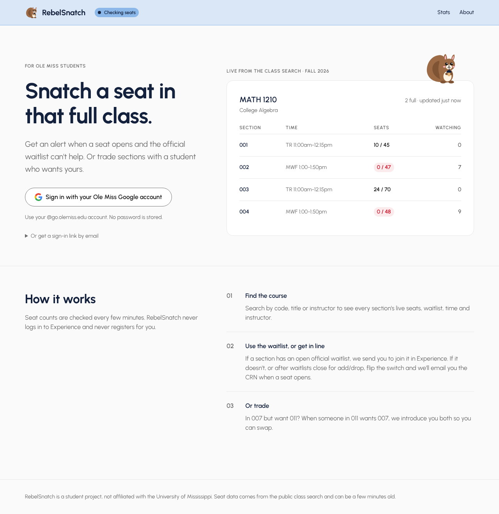
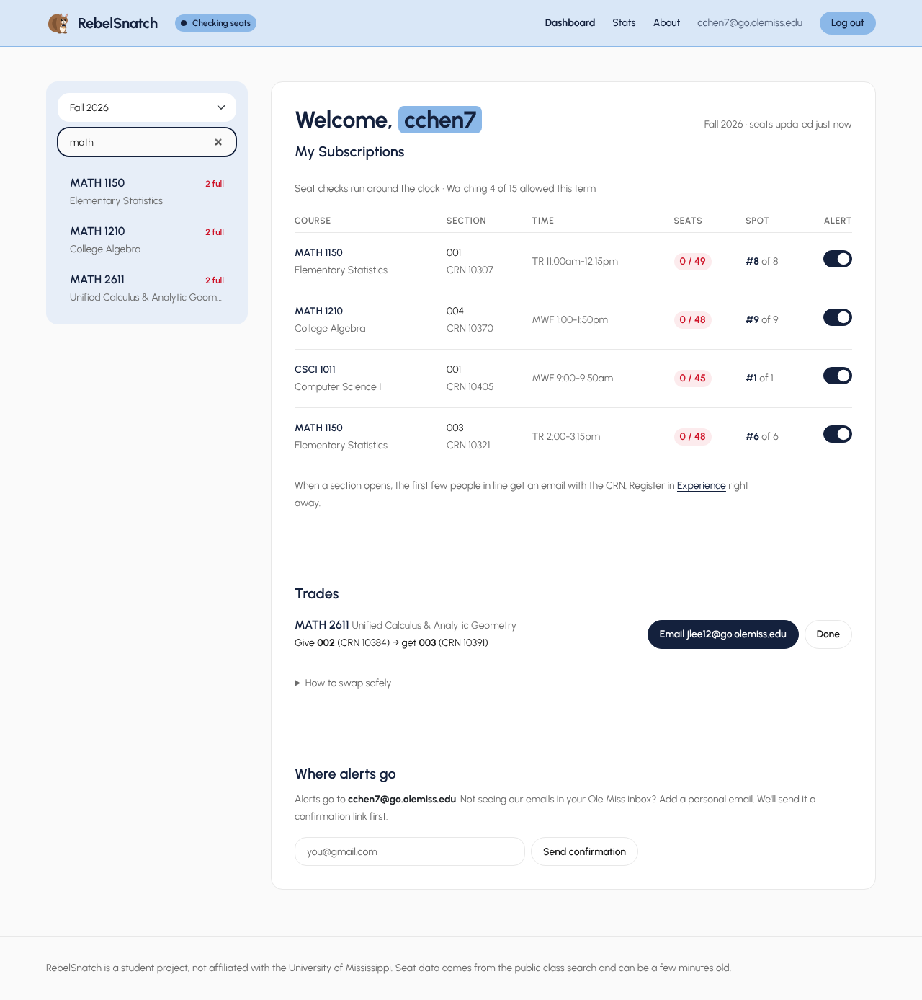
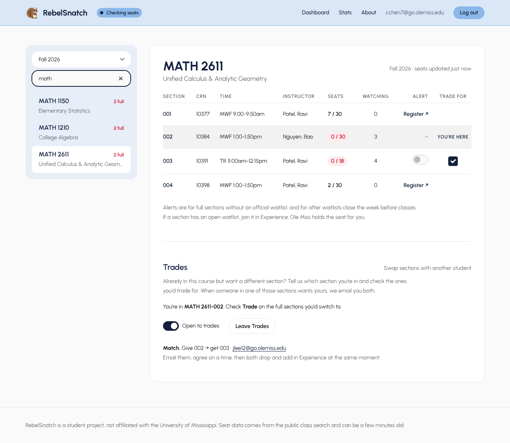
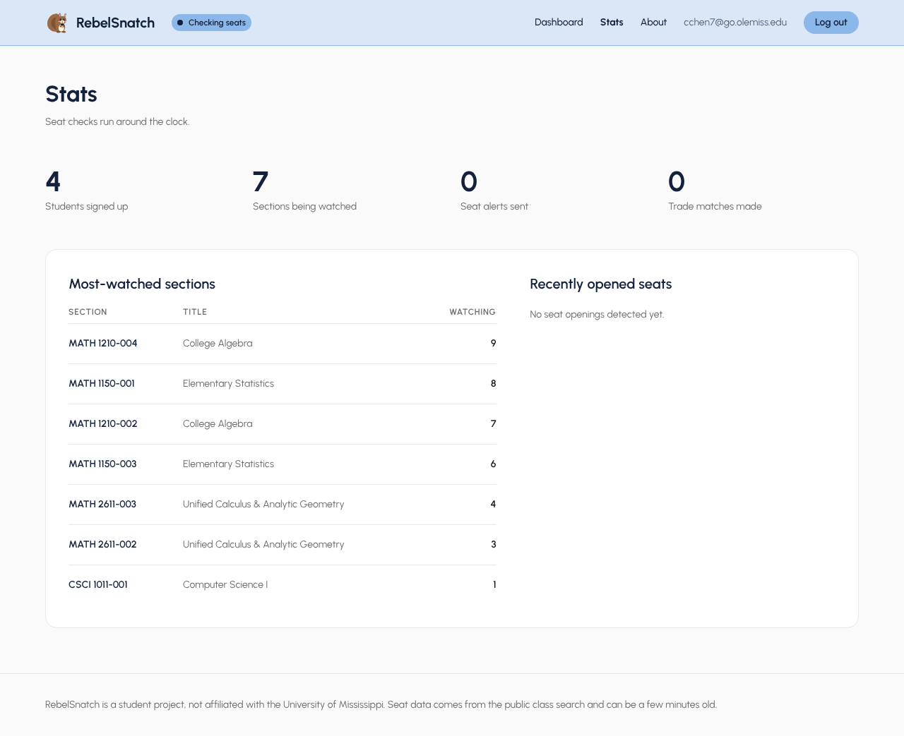
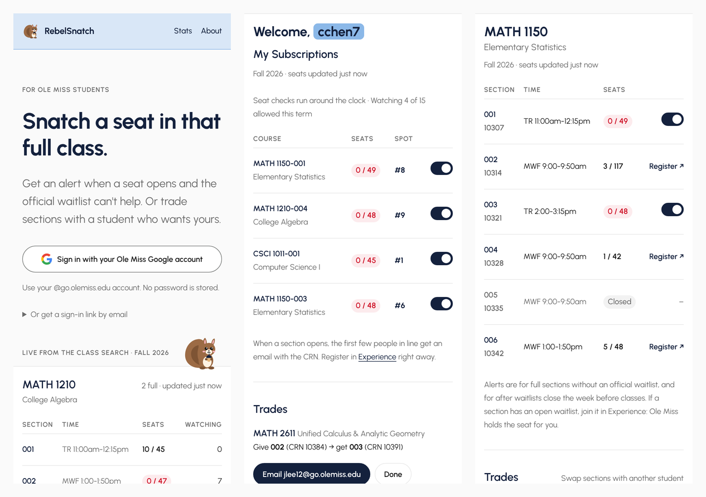

# RebelSnatch

**[rebelsnatch.com](https://rebelsnatch.com)** helps Ole Miss students get into full classes. It does two things:

- **Seat alerts.** You get an email (and optionally a text) when a seat opens in a full section, for the cases where the official waitlist can't help.
- **Trades.** It finds a student who wants your section and has the one you want, so you can swap.

It's inspired by Princeton's [TigerSnatch](https://github.com/TigerAppsOrg/TigerSnatch). It reads the same public seat counts as Banner's "Browse Classes", never logs in as a student and never registers anyone. It only watches and tells you.



## Screenshots

**Dashboard.** Your place in line for every section you're watching, your trade matches, and where alerts go.



**Course page.** Live seats for every section. Full sections without a waitlist get an alert switch. Sections with an open official waitlist link to Experience instead. Join Trades to mark your section and the ones you'd swap for.



**Stats.** Public totals, the most-watched sections and recent seat openings. No one's email is ever shown.



**On a phone.**



## How it works

1. **The poller** (`olemiss_snatch/poll.py`) walks Banner 9's public class search for each term, one subject at a time with a polite 1-second delay. It saves every section's seats and waitlist counts to SQLite and records each time a full section opens.
2. **Alerts** (`notify.py`) go to the people watching that section, in the order they subscribed, three per open seat. A section with students on its official waitlist is skipped, because that seat goes to the waitlist first. Each email carries the CRN, a link to Experience and a one-click unsubscribe link.
3. **Trades** (`trades.py`) match pairs: A is in section X and wants Y, and B is in Y and wants X, within the same course. Both students get one email with each other's address and safe swap steps. Addresses are shown only to matched students.
4. **The website** (`web.py`, Flask) handles sign-in with an Ole Miss Google account or an emailed one-time link, live course search, subscription switches, Trades, settings, `/stats` and `/admin`.

## Features

- **Waitlist-aware.** Sections with an active official waitlist send you to join it in Experience, where Ole Miss holds the seat for you. Alerts cover sections without a waitlist and add/drop week after waitlists close.
- **Sign-in:** an Ole Miss Google account only (`hd` and domain checked), or a one-time email link. No passwords are stored.
- **Personal alert email**, confirmed from that inbox first, for when Ole Miss mail filters new senders.
- **Text alerts** through Twilio, opt-in, with STOP honored.
- **Fair limits:** a maximum number of sections per student per term, and a rate limit on sign-in links.
- **Alert windows:** seat checks run only during registration and add/drop if you set `POLL_WINDOWS`. The nav shows "Checking seats" or "Paused".
- **Admin tools:** totals, the most-watched sections, blocking a student, and clearing a section's subscriptions.

## Run it locally

```bash
python3 -m venv venv
source venv/bin/activate
pip install -r requirements.txt -r requirements-dev.txt
cp .env.example .env            # then fill in SECRET_KEY at least

# terminal 1: fill the database (see term codes with --list-terms)
python -m olemiss_snatch.poll --term 202710 --every 300

# terminal 2: the website
python -m flask --app olemiss_snatch.web run --debug
```

Open http://127.0.0.1:5000. On a Mac, `localhost:5000` can hit AirPlay Receiver and return 403. Without email settings, sign-in links and alerts are printed in the terminal instead of being sent.

Other poller commands:

```bash
python -m olemiss_snatch.poll --list-terms                     # term codes
python -m olemiss_snatch.poll --term 202710 --subjects MATH CSCI   # one pass, a few subjects
python -m olemiss_snatch.poll --test-email you@go.olemiss.edu  # check email sending
```

## Deploy (Railway + Resend + a domain)

**Cost:** Railway Hobby is about $5/month, a domain about $10/year, and Resend's free tier covers 3,000 emails/month. Railway blocks SMTP, so on the server the app sends email through Resend's API.

1. **Domain.** Buy one, for example at Cloudflare Registrar.
2. **Resend.** Add the domain, copy the DNS records it shows into your DNS provider, click Verify, and create an API key (`re_...`).
3. **Railway.**
   - Create a new project from this GitHub repo.
   - Attach a **volume** at `/data`.
   - Add the variables below.

   `railway.json` runs `start.sh`, which starts the poller in the background and gunicorn in front, and health-checks `/healthz`.
4. **Custom domain.** In Railway, go to Settings → Networking → Custom Domain. Add the CNAME it gives you, set to DNS only. Railway issues HTTPS automatically.
5. **Google sign-in.**
   - In Google Cloud Console, set up the OAuth consent screen: External, with scopes `openid` and `email`, then publish it.
   - Create a Web OAuth client with redirect URI `https://<your-domain>/auth/google/callback`.

**Minimum variables:**

```
SECRET_KEY=<python -c "import secrets; print(secrets.token_hex(32))">
BASE_URL=https://rebelsnatch.com
RESEND_API_KEY=re_...
MAIL_FROM=RebelSnatch <alerts@rebelsnatch.com>
SNATCH_DB=/data/snatch.db
SNATCH_TERMS=202730 202710
POLL_EVERY=300
GOOGLE_CLIENT_ID=...apps.googleusercontent.com
GOOGLE_CLIENT_SECRET=...
```

**Optional variables:**

| Variable | What it does | Example |
|---|---|---|
| `POLL_WINDOWS` | Only check seats in these windows (Central time, `;`-separated). Unset means always | `2026-10-26 00:00 to 2027-02-01 23:59` |
| `MAX_SUBSCRIPTIONS` | Sections one student can watch per term (default 15) | `15` |
| `ADMIN_EMAILS` | Who can open `/admin` | `you@go.olemiss.edu` |
| `ALLOWED_EMAIL_DOMAINS` | Who may sign in | `go.olemiss.edu,olemiss.edu` |
| `TWILIO_SID`, `TWILIO_TOKEN`, `TWILIO_FROM` | Turn on text alerts. US texting needs a verified toll-free number or A2P 10DLC registration | from twilio.com |

`.env.example` documents every setting. When registration moves to a new term, update `SNATCH_TERMS`.

## Notes on the data

- **Term codes** look like `YYYYTT`, where `10` is Fall, `20` Winter, `30` Spring and `50` Summer. Banner names the academic year by its spring, so `202710` is Fall 2026 and `202730` is Spring 2027.
- **`seatsAvailable`** can go negative through overrides. Anything at or below 0 counts as full.
- **`maximumEnrollment` of 0** usually means the section is cancelled or closed. It never triggers alerts.
- **Waitlist fields after waitlists close:** how Banner reports them then is unconfirmed. The rule lives in one function, `banner.has_active_waitlist`.

## Project layout

```
olemiss_snatch/
  banner.py        Banner 9 class search client and section parsing
  poll.py          the poller loop (terms, windows, retries)
  db.py            SQLite schema and queries
  notify.py        email (Resend/SMTP) and Twilio texts
  trades.py        trade matching and match emails
  google_auth.py   Ole Miss Google sign-in (OIDC)
  schedule.py      POLL_WINDOWS parsing
  web.py           Flask site and JSON API
  templates/, static/
tests/             pytest suite
DESIGN.md          the design system: colors, type, spacing, mascot rules
```

## Design

The UI follows [`DESIGN.md`](DESIGN.md). The colors are navy, with red reserved for full sections, and Ole Miss powder blue is the one pop of color. Type is Urbanist on a strict 8px grid, with no decoration beyond the campus squirrel.

## Tests

```bash
python -m pytest -q
```

---

RebelSnatch is a student project and isn't affiliated with the University of Mississippi.
